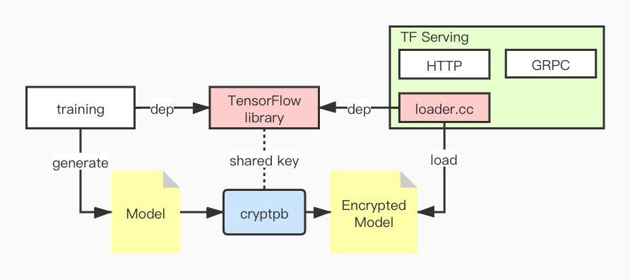

# TensorFlow Serving

[README](README.md) | [中文文档](README_zh.md)

## 简介

众所周知，机器学习的模型是每个 AI 企业最重要的”知识产权“，而 `TensorFlow Serving` 以 `Protobuffer` 文件编码模型，在运行时直接加载模型，这很有可能导致模型泄露，从而造成企业难以估量的损失。此 repo 提供一种保护模型文件安全性的方法，它依赖我们 fork 的 TensorFlow repo: [https://github.com/Laiye-Tech/tensorflow](https://github.com/Laiye-Tech/tensorflow)，我们修改了 TensorFlow 代码中的`ReadBinaryProto`方法用来读取加密过的`SavedModel`(Protobuffer 文件)，该文件需要用我们开源的[加密工具](https://github.com/Laiye-Tech/cryptpb)加密。

## 模型加密架构



我们的加密工具和 `TensorFlow` 解密模块(`loader.cc`)共享秘钥，秘钥是硬编码在代码中的，在模型训练完成后用加密工具将模型加密为密文模型，`TF-serving` 需要读取密文的模型解密后使用。

> 为了提高安全性，构建后的 tfserving 可执行文件还可以用 [upx](https://upx.github.io/) 工具做一次混淆。

## 从源码构建

### 准备工作

出于安全性考虑，不要用默认的秘钥。你可以在这[cryptfile.cc#L119](https://github.com/Laiye-Tech/cryptpb/blob/main/cryptfile/cryptfile.cc#L119)和[env.cc#L62](https://github.com/Laiye-Tech/tensorflow/blob/master/tensorflow/core/platform/env.cc#L62)两个位置修改共享秘钥。我们目前采用 `AES` 加密算法，你可以修改它的 key 和 iv。

> 注意：这两处的 key 和 iv 需要保持一致

### 构建

跟官方的构建方式一样，但是官方构建的`Dockerfile` 会在构建时下载指定版本的代码，由于我们会在本地修改秘钥，所以需要用如下方式进行本地编译。

---

**本地编译**

你可以修改 [WORKSPACE#L18](https://github.com/Laiye-Tech/serving/blob/master/WORKSPACE#L18) 使用 bazel 的 `local_repository` 规则

1. 把修改过的秘钥的 tensorflow 代码目录拷贝进当前serving目录下，这样它会被 docker build context 包含。

```bash
cp -r ../tensorflow ./tensorflow
```

2. 修改下列 Dockerfile 和 bazel 配置文件以使用本地编译

- tensorflow_serving/tools/docker/Dockerfile.devel
- tensorflow_serving/tools/docker/Dockerfile.devel-gpu
- WORKSPACE
- tensorflow_serving/workspace.bzl (possible, fix some checksum errors when building)

例如，可以应用这个 [patch](./local_build.patch) 来进行本地编译。

---

**CPU**

```sh
docker build --build-arg \
    -t tensorflow-serving-devel \
    -f tensorflow_serving/tools/docker/Dockerfile.devel .

docker build --build-arg \
    TF_SERVING_BUILD_IMAGE=tensorflow-serving-devel \
    -t tensorflow-serving \
    -f tensorflow_serving/tools/docker/Dockerfile .
```

**GPU**

```sh
docker build -t tensorflow-serving-devel-gpu \
    -f tensorflow_serving/tools/docker/Dockerfile.devel-gpu .

docker build --build-arg \
    TF_SERVING_BUILD_IMAGE=tensorflow-serving-devel-gpu \
    -t tensorflow-serving-gpu \
    -f tensorflow_serving/tools/docker/Dockerfile.gpu .
```

### 运行

确保 `saved_model.pb` 是用我们的 [加密工具](https://github.com/Laiye-Tech/cryptpb#run) 加密过的。

```sh
# Location of demo models
export MODEL_DIR=$PWD/tensorflow_serving/servables/tensorflow/testdata/saved_model_half_plus_two_cpu/
export MODEL_NAME=half_plus_two

# Start TensorFlow Serving container and open the REST API port
docker run -t --rm -p 8501:8501 -p 8500:8500 \
    -v "$MODEL_DIR:/models/$MODEL_NAME" \
    -e MODEL_NAME=$MODEL_NAME \
    tensorflow-serving &

# Query the model using the predict API
curl -d '{"instances": [1.0, 2.0, 5.0]}' \
    -X POST http://localhost:8501/v1/models/half_plus_two:predict

# Returns => { "predictions": [2.5, 3.0, 4.5] }
```

## 升级

创建一个新的 branch，然后 rebase 到官方的要升级的 tag。用这个 branch 来构建升级过的 tensorflow serving。以升级到 2.4.0 为例

```bash
# 1. 升级 tensorflow
git clone https://github.com/Laiye-Tech/tensorflow
cd tensorflow
git branch b2.4.0
git remote add tf https://github.com/tensorflow/tensorflow
git fetch tf refs/tags/v2.4.0:refs/tags/v2.4.0
git checkout -b tf2.4.0 tags/v2.4.0
git checkout b2.4.0
git rebase tf2.4.0
# 解决可能的冲突
git push --set-upstream origin b2.4.0

# 2. 升级 tensorflow serving
git clone https://github.com/Laiye-Tech/serving
cd tensorflow
git branch b2.4.0
git remote add tf https://github.com/tensorflow/serving
git fetch tf
git checkout -b tf2.4.0 tags/2.4.0
git checkout b2.4.0
git rebase tf2.4.0
# 解决可能的冲突
git push --set-upstream origin b2.4.0

# 然后修改 ###Prepare 段落描述的秘钥，参照 ### Build 段落进行构建。
```
